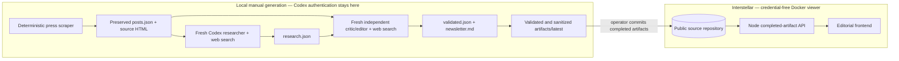

# Prommer Press Scout

Prommer Press Scout is a small, inspectable two-agent workflow that turns the two latest entries from the public [prommer.net press page](https://prommer.net/en/tech/press/) into a sourced editorial briefing.

The project is an assessment artifact, not official prommer.net content. Every published page is labelled as the latest completed manual run.

## Workflow

Generation and serving are deliberately separate execution environments. Codex runs only during a manual local generation command; the public container cannot run the scraper or either agent.



### Local generation

1. The operator runs `npm run generate` on a locally authenticated Codex installation.
2. `src/coverage.js` fetches the configured press page, isolates `#coverage`, and preserves the first two unique entries in page order.
3. A fresh ephemeral Codex session receives only the preserved post metadata and `prompts/researcher.md`. It searches for adjacent papers, events, reports, interviews, and other useful sources, then produces schema-constrained `research.json`.
4. A second fresh ephemeral Codex session receives the original posts and the first agent's JSON through an explicit handoff. It independently verifies every candidate, rejects weak, stale, duplicated, or unsupported items, and produces `validated.json` plus `newsletter.md` using `prompts/editor.md`.
5. Deterministic code validates both agent outputs, sanitizes the Markdown, records checksums and events, and atomically replaces `artifacts/latest` only after the complete run succeeds.
6. The operator reviews and commits the completed public artifacts. The generation command itself does not commit or deploy anything.

### Public delivery

1. Infra builds the selected public repository revision into a Docker image.
2. The Docker build installs production dependencies only, excluding the development-only Codex package.
3. The image copies `artifacts/latest`, the Node completed-artifact API, and the frontend.
4. Interstellar serves that immutable completed run. It receives no Codex installation, OpenAI credential, scraper trigger, or generation endpoint.

## Local generation

Prerequisites:

- Node.js 22+
- an existing local Codex CLI login (`codex login`)
- network access for the configured press page and Codex web search

```bash
npm ci
npm test
npm run generate
npm start
```

Open `http://localhost:3000`. Generation is intentionally manual. Running `npm run generate` replaces `artifacts/latest` only after both agents finish and every deterministic validation succeeds. Failed runs remain under ignored `artifacts/failed/` for local diagnosis.

Useful bounded configuration:

```text
PRESS_PAGE_URL=https://prommer.net/en/tech/press/
MAX_ARTICLES=2
FETCH_TIMEOUT_MS=15000
AGENT_TIMEOUT_MS=600000
MAX_PRESS_BYTES=2097152
MAX_AGENT_OUTPUT_BYTES=524288
```

The Codex sessions are ephemeral and ignore user configuration while still using the caller's existing local authentication. The prompts, schemas, preserved inputs, handoff, validation decision, newsletter, event log, and checksums are all retained in the completed artifact directory.

## Docker viewer

Build the credential-free viewer after completing a local run:

```bash
docker build -t prommer-press-scout:local .
docker run --rm -p 3000:3000 prommer-press-scout:local
```

The container does not contain Codex, an OpenAI API key, OAuth material, or a public generation endpoint. It serves only:

- `/` — editorial frontend
- `/api/latest` — checksummed completed artifacts
- `/healthz` — viewer readiness and artifact availability

## Public-safety boundaries

- Only the configured press page is fetched by deterministic application code; redirects to another origin are refused.
- Web content and agent handoffs are explicitly treated as untrusted data in both prompts.
- The two agents run in independent fresh sessions with read-only sandboxes and schema-constrained final outputs.
- Output sizes, execution time, article count, redirects, URLs, dates, and handoff shapes are bounded and validated.
- Generated Markdown is sanitized before browser delivery, and completed artifacts are verified against recorded SHA-256 checksums.
- There is no public trigger, background generation, credential transport, database, or administrative interface.

## Repository map

```text
prompts/             committed researcher and critic/editor prompts
schemas/             strict output contracts for both agents
scripts/generate.js  manual pipeline entry point
src/coverage.js      deterministic scraper
src/codex.js         fresh Codex process boundary
src/pipeline.js      orchestration and inspectable handoff
src/validate.js      deterministic semantic boundary checks
src/server.js        credential-free completed-artifact API/viewer
artifacts/latest/    latest completed public run
```
